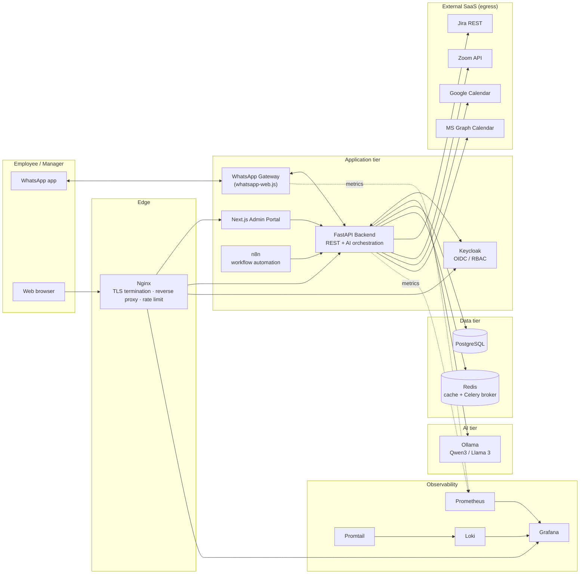
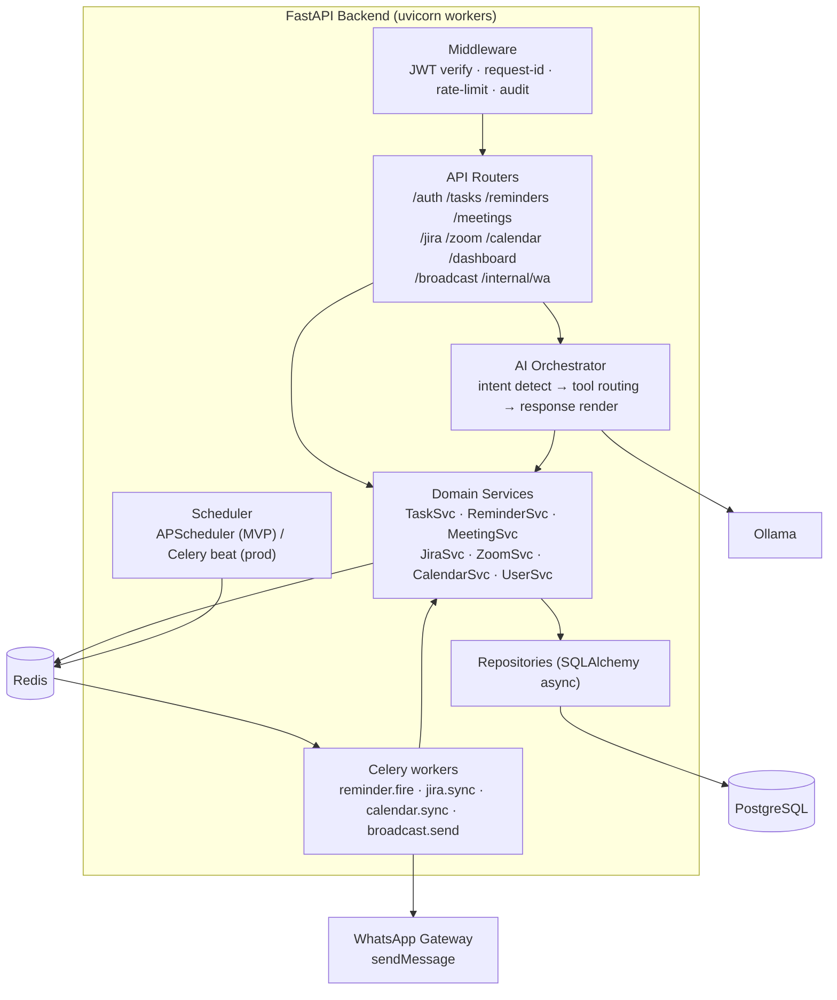
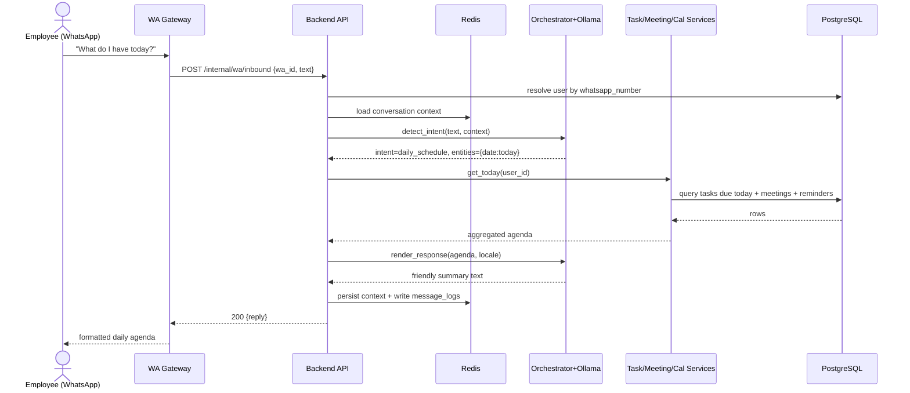
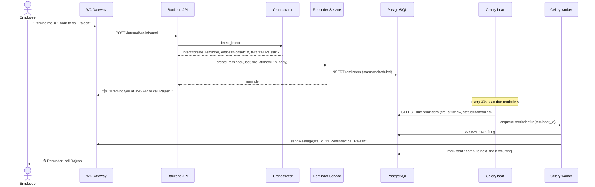
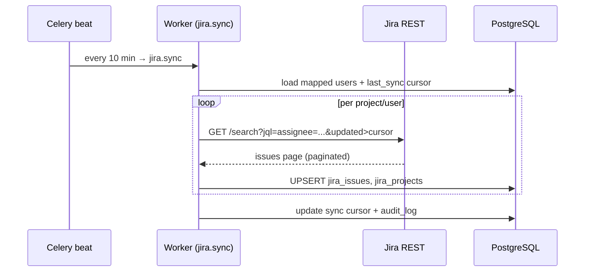
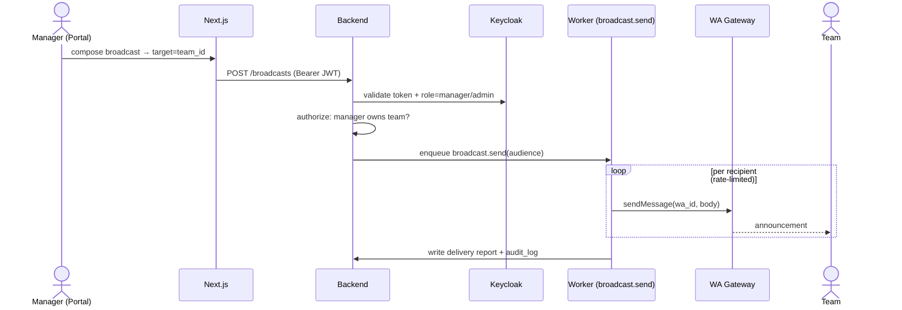

# 01 — Architecture

- [1. High-Level Architecture](#1-high-level-architecture)
- [2. Low-Level Architecture](#2-low-level-architecture)
- [3. Service Breakdown](#3-service-breakdown)
- [4. Message Flow](#4-message-flow)
- [5. Sequence Diagrams](#5-sequence-diagrams)

---

## 1. High-Level Architecture



**Tiers**

1. **Edge** — Nginx terminates TLS, reverse-proxies, applies global rate limits and WAF-style rules.
2. **Application** — stateless FastAPI backend (horizontally scalable), the WhatsApp gateway (stateful, holds the WA session), the Next.js portal, n8n, and Keycloak.
3. **AI** — Ollama serving local models; GPU node(s) at scale.
4. **Data** — PostgreSQL (source of truth) + Redis (cache, rate-limit counters, Celery broker, conversation state).
5. **Observability** — Prometheus/Grafana metrics, Loki/Promtail logs.

---

## 2. Low-Level Architecture (Backend internals)



**Key internal contracts**

- The **AI Orchestrator** never talks to the database directly; it calls **Domain Services** through a tool registry. This keeps the LLM sandboxed to a finite, validated set of actions.
- **Domain Services** are the only layer that uses **Repositories**. Integrations (Jira/Zoom/Calendar) are wrapped as services so the orchestrator treats local data and remote data uniformly.
- **Scheduler → Redis → Celery workers** decouples "when to fire" from "deliver via WhatsApp," so reminder delivery survives backend restarts.

---

## 3. Service Breakdown

| # | Layer / Service | Tech | Responsibility | State |
|---|-----------------|------|----------------|-------|
| 1 | **WhatsApp Gateway** | Node 20, whatsapp-web.js | Maintain WA session, normalize inbound messages → backend, send outbound | Stateful (LocalAuth session on volume) |
| 2 | **API Gateway/Edge** | Nginx | TLS, routing, rate limiting, gzip, security headers | Stateless |
| 3 | **Backend API** | Python 3.12, FastAPI, SQLAlchemy 2 async | REST endpoints, business logic, AI orchestration entrypoint | Stateless |
| 4 | **AI Orchestrator** | (module in backend) Ollama client | Intent detection, tool routing, NL response generation | Stateless (conv. state in Redis) |
| 5 | **Task Service** | (module) | CRUD, assignment, status, priority, comments, attachments, recurrence, escalation | — |
| 6 | **Reminder Engine** | (module) + Celery beat | Parse NL time, schedule one-off/recurring reminders, deliver via WA | Schedule in PG, jobs in Redis |
| 7 | **Meeting Service** | (module) | Internal meetings + aggregation of Zoom/Calendar meetings | — |
| 8 | **Jira Integration** | (module) httpx | Pull assigned issues/sprints/boards, map users, periodic sync, local cache | Cache in PG |
| 9 | **Zoom Integration** | (module) httpx, S2S OAuth | Fetch meetings, links, reminders | Cache in PG |
| 10 | **Calendar Integration** | (module) Google API + MS Graph | Daily/weekly schedule, availability, sync | Cache in PG |
| 11 | **Notification Engine** | (module) + Celery | Fan-out reminders, broadcasts, escalations to WhatsApp/portal | Queue in Redis |
| 12 | **Web Admin Portal** | Next.js 14, React, TS, Tailwind | Dashboards, management UIs for all roles | Client + SSR |
| 13 | **Auth & RBAC** | Keycloak (OIDC) + backend policy | SSO, token issuance; backend enforces permission matrix | Keycloak DB |
| 14 | **Workflow Automation** | n8n | Low-code glue: report schedules, custom integrations, alert routing | n8n DB |
| 15 | **Reporting** | (module) + Grafana | Aggregations, exports (CSV/PDF), team analytics | — |
| 16 | **Scheduler** | APScheduler (MVP) → Celery beat (prod) | Cron + interval jobs: syncs, reminders, escalation sweeps, digests | Redis |

---

## 4. Message Flow

```
User ──▶ WhatsApp ──▶ WhatsApp Gateway ──▶ Backend API (/internal/wa/inbound)
                                                  │
                                                  ▼
                                          AI Orchestrator
                                          (intent + entities)
                                                  │
                          ┌───────────────────────┼───────────────────────┐
                          ▼                        ▼                        ▼
                    Task Service            Reminder Engine          Jira/Zoom/Calendar
                          │                        │                        │
                          └───────────────────────┼───────────────────────┘
                                                  ▼
                                       Response renderer (LLM)
                                                  │
                          Backend ──▶ Gateway.sendMessage ──▶ WhatsApp ──▶ User
```

**Identity binding:** the gateway sends the sender's WhatsApp number (`wa_id`). The backend looks up `users.whatsapp_number` to resolve the employee. Unknown numbers get an enrollment prompt (one-time link code issued in the portal). All inbound/outbound messages are written to `message_logs`.

---

## 5. Sequence Diagrams

### 5.1 "What do I have today?" (daily schedule)



### 5.2 "Remind me in 1 hour to call Rajesh" (reminder creation + firing)



### 5.3 Periodic Jira sync



### 5.4 Manager broadcast


