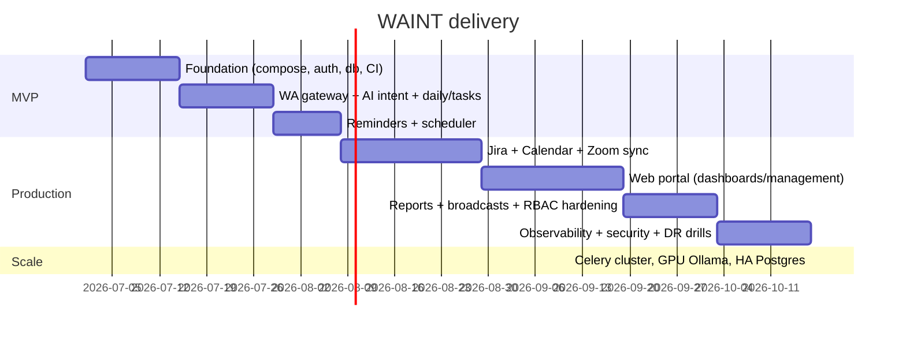

# 07 — Development Roadmap & Scaling Strategy

## 1. Roadmap

### MVP phase (4–6 weeks) — prove the loop end-to-end

Scope:
- Docker Compose stack: Postgres, Redis, Ollama, Keycloak, Nginx, backend, gateway.
- WhatsApp gateway (whatsapp-web.js) ↔ backend internal endpoint.
- AI: intent detection + response rendering for: `daily_schedule`, `weekly_schedule`, `task_lookup`, `task_status`, `create_task`, `create_reminder`, `next_meeting`, `help`.
- Internal Task system (CRUD, assign, status, priority, due dates).
- Reminder engine (one-off + recurring) with APScheduler.
- Minimal portal: login, my tasks, create task/reminder.
- Basic logging + `/healthz`.

Exit criteria: an enrolled employee can run all 11 sample WhatsApp queries and get correct, fast (<5s p95) replies; managers can create/assign via portal.

### Production phase (next 6–10 weeks)

- Integrations: Jira sync, Google + Outlook calendar, Zoom meetings.
- Full web portal: role-aware dashboards, meeting/reminder management, reports, team analytics, Jira/calendar overviews, broadcasts.
- Switch scheduler APScheduler → **Celery beat + workers** (durable, multi-instance).
- Keycloak full RBAC + audit logs + rate limiting + encryption-at-rest.
- Observability stack (Prometheus/Grafana/Loki/Promtail) + alerts.
- n8n for report scheduling / custom workflow glue.
- Backup + DR runbook tested.

### Phase 3 — intelligence & scale

- RAG knowledge base (policies/FAQs) via pgvector.
- Proactive nudges (morning digest, pre-meeting heads-up, overdue escalations).
- Voice notes (Whisper, self-hosted) → transcription → intent.
- Multi-number / WhatsApp Cloud API migration option.

## 2. Scaling strategy

Guiding principle: the backend is **stateless** (scale horizontally); the bottlenecks
in order are **Ollama (GPU)**, **Postgres**, and the **single WhatsApp session**.

| Users | Backend | Ollama / LLM | Postgres | Redis | WhatsApp | Notes |
|------:|---------|--------------|----------|-------|----------|-------|
| **100** | 1 host, 2 uvicorn workers; APScheduler ok | 1 CPU model (qwen 7B) or small GPU | single node, daily dump | single | 1 gateway/number | Everything on one 8-core/32GB box. |
| **500** | 2 backend replicas behind Nginx; move to Celery beat+2 workers | 1 GPU (e.g. RTX 4090/L4); keep-alive warm | single node tuned (PgBouncer, indexes) + hourly dump | single (persistence on) | 1 number, pacing on broadcasts | Split data/app onto 2 hosts. |
| **1000** | 3–4 backend replicas; 3–4 Celery workers; autoscale on queue depth | 2 GPU Ollama instances + LB; response cache | primary + streaming **read replica**; PgBouncer | Redis with persistence; consider Sentinel | 1–2 numbers (route by team) | Hot standby DB for HA. |
| **5000** | 6–10 backend replicas (k8s/Swarm); dedicated Celery pools per queue (reminders/sync/broadcast) | GPU pool (3–5) behind LB, per-intent model routing, aggressive caching + batching | partitioned/large primary + multiple read replicas; PITR; consider Citus for horizontal | Redis Cluster | **multiple numbers / Cloud API**; sharded gateways by team/region | Move to Kubernetes; HPA on CPU+queue; per-tenant rate limits. |

### Scaling levers (apply as needed)
- **LLM throughput:** quantized models, response caching (Redis), batching, per-intent model routing (small model for classification, larger only for rendering), GPU pool + load balancer.
- **DB:** PgBouncer pooling, read replicas for dashboards/reports, partition `message_logs`/`audit_logs` by month, retention purge.
- **Async:** dedicated Celery queues (reminders / integration-sync / broadcast) so a slow Jira sync never delays reminders.
- **Reminder precision at scale:** beat scans the partial index `idx_reminders_due` every 30s; at high volume shorten to 10s and shard by `user_id % N` across workers.
- **WhatsApp:** the gateway is the hardest to scale (one session/number). Partition users across multiple numbers/gateways by team or region; the abstraction (`sendMessage`/inbound webhook) keeps backend unchanged. For true enterprise scale migrate to WhatsApp Cloud API.
- **Stateless everything else:** session/state lives in Redis + Postgres so any backend replica can serve any request.
